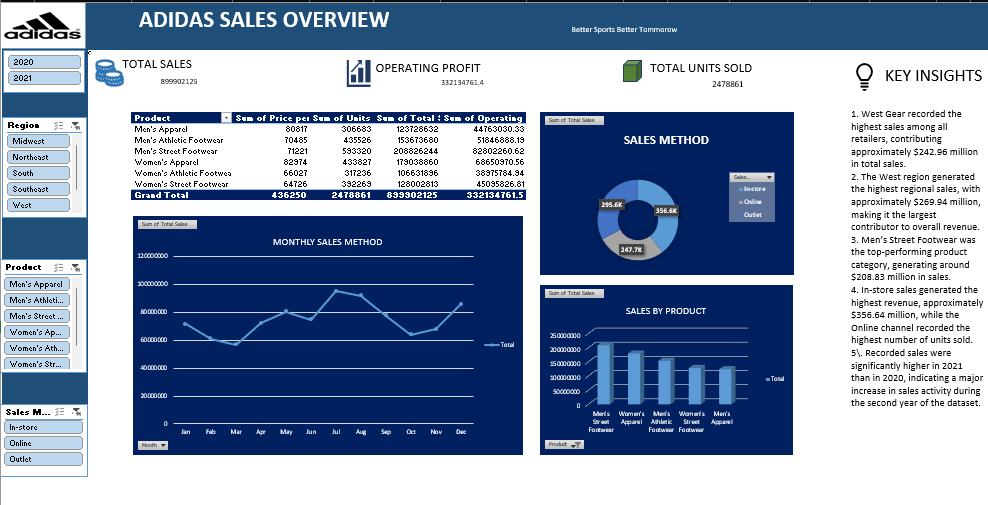

# Adidas US Sales Analysis 📊


##  Project Overview

This project presents an **Adidas US Sales Analysis** using Microsoft Excel.

The objective of this project is to analyze Adidas sales data from **2020–2021** and transform raw sales data into meaningful business insights through data cleaning, analysis, PivotTables, charts, KPIs, and an interactive dashboard.

The analysis focuses on understanding **sales performance, product performance, regional contribution, sales methods, operating profit, units sold, and monthly sales trends**.

---

##  Dashboard Preview



### Dashboard Highlights

The dashboard provides an interactive overview of Adidas' US sales performance, including:

-  Total Sales
-  Operating Profit
-  Total Units Sold
-  Sales by Product
-  Regional Sales Performance
-  Sales Method Analysis
-  Monthly Sales Trends
-  Key Business Insights

---

##  Project Objectives

The main objectives of this project are:

- Analyze overall Adidas sales performance.
- Identify high-performing products.
- Compare sales performance across regions.
- Analyze sales through different sales methods.
- Examine monthly sales trends.
- Analyze operating profit and units sold.
- Identify important business patterns from the dataset.
- Build an interactive Excel dashboard.
- Present data-driven insights in a simple and understandable format.

---

##  Dataset

The dataset contains Adidas US sales information for the period **2020–2021**.

### Dataset Source

The dataset/reference used for this project is available on Kaggle:

 [Adidas US Sales Analysis 2020–2021 – Kaggle](https://www.kaggle.com/code/oladigbolutaofeek/adidas-us-sales-analysis-2020-2021)

### Dataset Fields

The dataset includes information such as:

| Field | Description |
|---|---|
| Retailer | Retailer selling Adidas products |
| Region | Geographic sales region |
| State | US state |
| City | City of sale |
| Product | Adidas product category |
| Price per Unit | Price of each unit |
| Units Sold | Number of units sold |
| Total Sales | Total revenue generated |
| Operating Profit | Profit generated |
| Operating Margin | Operating profit margin |
| Sales Method | In-store, Online, or Outlet |
| Invoice Date | Date of transaction |

---

##  Key Performance Indicators

The dashboard tracks the following major KPIs:

| KPI | Value |
|---|---:|
| **Total Sales** | 899,902,125 |
| **Operating Profit** | 332,134,761.40 |
| **Total Units Sold** | 2,478,861 |

These KPIs provide a quick overview of the overall business performance represented in the dataset.

---

##  Analysis Performed

### 1. Overall Sales Analysis

The project examines total sales and operating profit to understand the overall financial performance of the business.

### 2. Product Analysis

Products are compared based on:

- Total Sales
- Units Sold
- Price per Unit
- Operating Profit

This helps identify products that contribute significantly to overall revenue.

### 3. Regional Analysis

Sales performance is analyzed across different regions, including:

- Midwest
- Northeast
- South
- Southeast
- West

This helps identify differences in regional sales contribution.

### 4. Sales Method Analysis

Sales are analyzed across different channels:

- In-store
- Online
- Outlet

This provides an understanding of how different sales channels contribute to overall revenue.

### 5. Monthly Sales Trend

Monthly sales are analyzed to identify:

- High-sales months
- Low-sales months
- Seasonal patterns
- Changes in sales activity over time

### 6. Operating Profit Analysis

Operating profit is analyzed across products and business segments to understand profitability.

---

##  Key Insights

Based on the dashboard analysis:

- **West region** recorded the highest sales among the regions, contributing approximately **$246.9 million** in total sales.
- The **West region** generated the highest regional sales contribution in the dataset.
- **In-store sales** generated the highest revenue among the three sales methods.
- **Men's Street Footwear** recorded the highest sales among the products shown in the dashboard.
- Sales activity increased significantly during **2021 compared with 2020**, indicating stronger sales performance during the later period of the dataset.
- The dashboard shows noticeable variation in monthly sales, with stronger performance during several months in the middle and later part of the year.

> These insights are based on the analyzed dataset and the Excel dashboard created for this project.

---

##  Tools & Techniques Used

### Microsoft Excel

The project was developed primarily using Microsoft Excel.

### Excel Features Used

- Data Cleaning
- Data Formatting
- PivotTables
- PivotCharts
- Calculated Columns
- Filters
- Slicers
- KPI Cards
- Charts
- Dashboard Design
- Data Visualization

---

##  Project Workflow

```text
                    Raw Dataset
                         │
                         ▼
                  Data Cleaning
                         │
                         ▼
                Data Preparation
                         │
                         ▼
              PivotTables & Analysis
                         │
                         ▼
                 KPI Calculation
                         │
                         ▼
             Charts & Visualizations
                         │
                         ▼
              Interactive Dashboard
                         │
                         ▼
                 Business Insights
````

---

##  Dashboard Components

The dashboard contains multiple analytical components:

### KPI Cards

* Total Sales
* Operating Profit
* Total Units Sold

### Visualizations

* Monthly Sales Trend
* Sales by Product
* Sales Method Distribution

### Interactive Filters

* Year
* Region
* Product
* Sales Method

### Supporting Analysis

* Product-level sales table
* Operating profit analysis
* Regional comparison
* Key business insights

---


```

---

##  Skills Demonstrated

This project demonstrates practical skills in:

*  Data Analysis
*  Data Cleaning
*  Data Visualization
*  PivotTables
*  PivotCharts
*  KPI Development
*  Dashboard Design
*  Business Insight Generation
*  Excel Reporting
*  Analytical Thinking

---

##  Future Improvements

The project can be further developed by:

* Recreating the dashboard in **Power BI**.
* Using **Power Query** to automate data cleaning and transformation.
* Using **Power Pivot and DAX** for advanced calculations.
* Adding more detailed regional and retailer analysis.
* Developing predictive sales analysis.
* Adding more advanced interactive visualizations.

---

##  About Me

I am a **BBA graduate currently developing my skills in Data Analytics**, with a focus on Excel, data visualization, and business analysis.

I am interested in using data to identify patterns, generate meaningful insights, and support better business decision-making.

This project is part of my journey toward building practical **Data Analytics and Business Intelligence** skills.

---

##  Project Resources

 **Dataset / Reference:**
[Adidas US Sales Analysis 2020–2021 – Kaggle](https://www.kaggle.com/code/oladigbolutaofeek/adidas-us-sales-analysis-2020-2021)

 **Excel Analysis:**
Available in this GitHub repository.

---

##  Thank You

Thank you for visiting this project!

Feel free to explore the analysis, dashboard, and other projects in my GitHub portfolio.

**If you found this project interesting, consider giving the repository a .**

````


